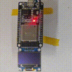
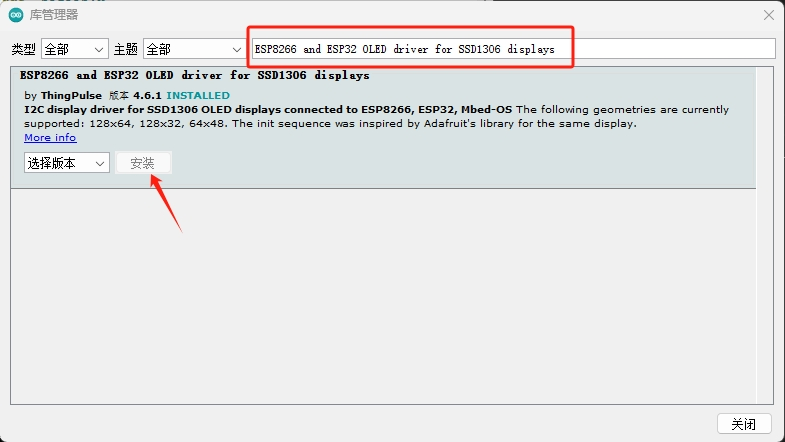
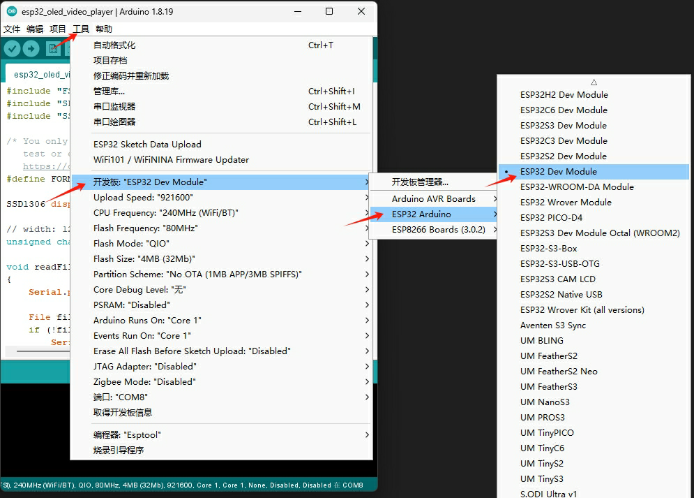
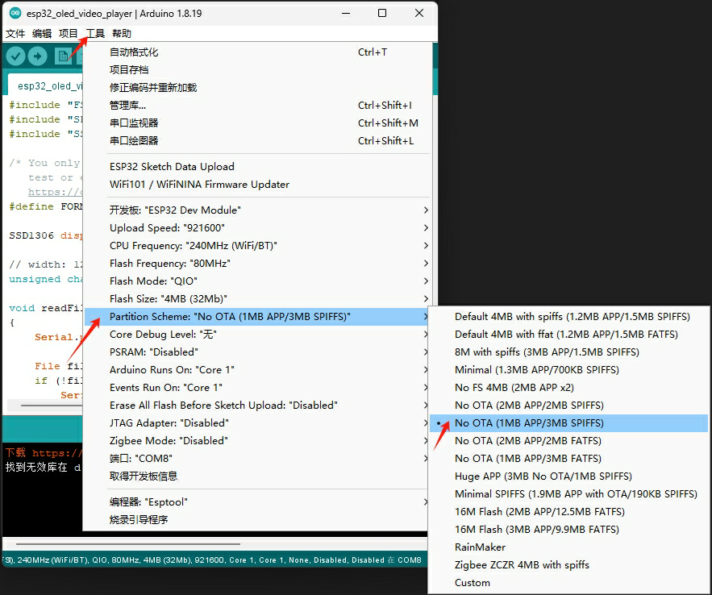
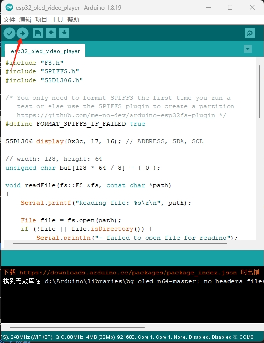
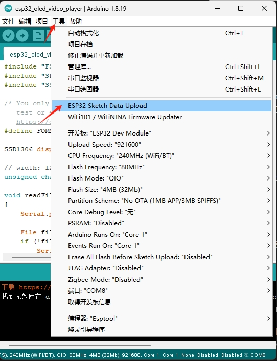
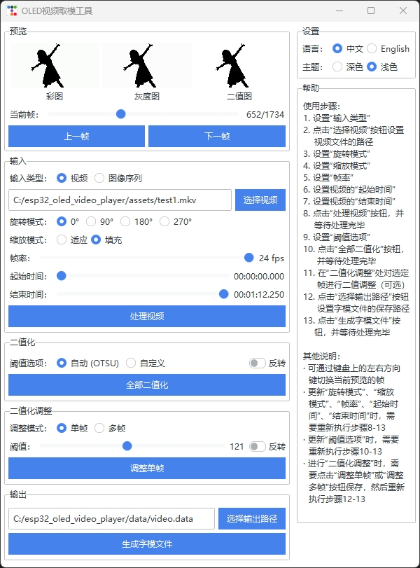

# ESP32 OLED New Year

一个基于 ESP32 的简单视频播放器, 利用 SPIFFS 文件系统存储视频文件 ([`data/video.data`](./data/video.data)), 并通过 OLED 显示屏播放.

## 硬件说明

- ESP32-WROOM-32

- 0.96' OLED (SSD1306, 128x64)

## 烧录说明

1. 安装 [`Arduino IDE`](https://www.arduino.cc/en/software/)

2. 安装 [`Arduino ESP32 filesystem uploader`](https://github.com/me-no-dev/arduino-esp32fs-plugin) 插件 (注意: 该插件不能在 Arduino IDE 2.X 上使用, 若使用 Arduino IDE 2.X 请查看 [`arduino-spiffs-upload`]( https://github.com/xtools-at/arduino-spiffs-upload/))

3. 使用 [`Arduino IDE`](https://www.arduino.cc/en/software/) 打开 [`esp32_oled_video_player.ino`](./esp32_oled_video_player.ino)

4. 按下 `Ctrl + Shift + I` 打开 `库管理器`, 搜索并安装 [`u8g2`](https://github.com/olikraus/u8g2/wiki/u8g2install) 库

   

5. 选择开发板为 `ESP32 Dev Module`

   

6. 选择带有 `SPIFFS` 文件系统的分区表

   

7. 上传程序

   
   
8. 上传 [`data/video.data`](./data/video.data) 到 `SPIFFS` 文件系统

   

## 其他说明

- [`data/video.data`](./data/video.data)  是 `视频文件`, 需要通过 [`converter.py`](./converter.py) 创建

- [`converter.py`](./converter.py) 支持输入 `视频` 或 `Adobe Premiere Pro` 等视频剪辑软件导出的 `图像序列`

   
    
## 参考资料

- [image-converter](https://github.com/coloz/image-converter/)

- [arduino-esp32fs-plugin](https://github.com/me-no-dev/arduino-esp32fs-plugin)

- [esp8266-oled-ssd1306](https://github.com/ThingPulse/esp8266-oled-ssd1306/)

- [u8g2](https://github.com/olikraus/u8g2/)

- [arduino-spiffs-upload]( https://github.com/xtools-at/arduino-spiffs-upload/)
