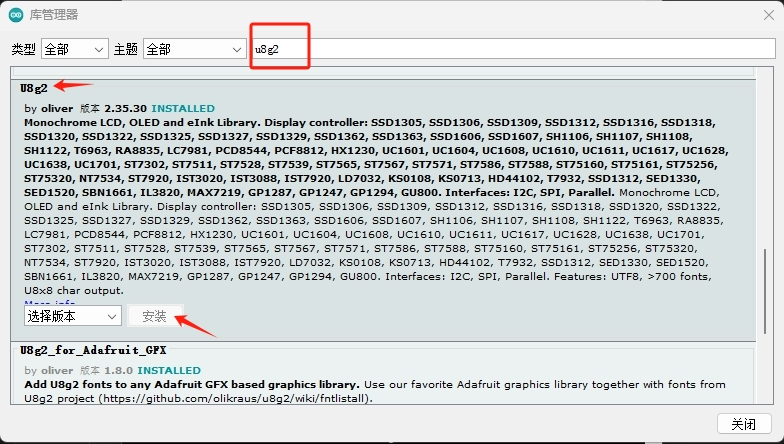

# ESP32 OLED New Year

B站投稿视频 [`我用ESP32+0.96寸OLED摆烂了你的AE作业`](https://www.bilibili.com/video/BV1ai4y197u9/) 的程序源码

## 硬件说明

- ESP32-WROOM-32

- 0.96' OLED (SSD1306, 128x64)

## 烧录说明

1. 安装 [`Arduino IDE`](https://www.arduino.cc/en/software/) (Legacy IDE 1.8.X)

2. 安装 [`Arduino ESP32 filesystem uploader`](https://github.com/me-no-dev/arduino-esp32fs-plugin) 插件 (注意: 该插件不能在 Arduino IDE 2.X 上使用)

3. 使用 [`Arduino IDE`](https://www.arduino.cc/en/software/) 打开 [`esp32_oled_video_player.ino`](./esp32_oled_video_player.ino)

4. 按下 `Ctrl + Shift + I` 打开 `库管理器`, 搜索并安装 [`ESP8266 and ESP32 OLED driver for SSD1306 displays`](https://github.com/ThingPulse/esp8266-oled-ssd1306/) 库

   

5. 选择开发板为 `ESP32 Dev Module`

   

6. 选择带有 `SPIFFS` 文件系统的分区表

   

7. 上传程序

   
   
8. 上传 [`data/video.bin`](./data/video.bin) 到 `SPIFFS` 文件系统

   

## 其他说明

[`data/video.bin`](./data/video.bin)  是 `图像序列` 的 `字模文件`, 创建流程如下: 

1. 使用 `Adobe Premiere Pro` 等视频剪辑软件将 `视频` 导出为 `图像序列`

2. 使用 [`converter.py`](./converter.py) 将 `图像序列` 转换为 `data/video.bin`

   
    
## 参考资料

- [image-converter](https://github.com/coloz/image-converter/)

- [arduino-esp32fs-plugin](https://github.com/me-no-dev/arduino-esp32fs-plugin)

- [esp8266-oled-ssd1306](https://github.com/ThingPulse/esp8266-oled-ssd1306/)